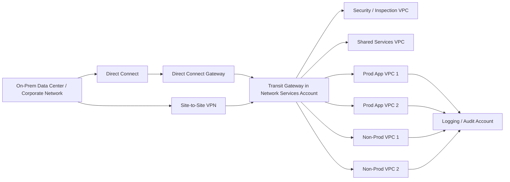

# AWS VPC and Enterprise Networking Guide

**Version:** 1.0  
**Focus:** Amazon VPC fundamentals, advanced connectivity patterns, multi-account enterprise networking, production use cases, and configuration examples  
**Audience:** Cloud Engineers, Platform Engineers, DevOps/MLOps, Enterprise Architects, Security/Network teams

---

## 1. Purpose

This document explains how Amazon VPC is designed in production environments and how enterprises typically build secure, scalable, and hybrid connectivity across:

- Multiple VPCs
- Multiple AWS accounts
- Multiple environments (Dev, Test, Non-Prod, Prod)
- Multiple Regions
- On-premises data centers / corporate networks

It also covers advanced networking topics such as:

- VPC Peering
- AWS Transit Gateway (TGW)
- AWS Direct Connect (DX)
- AWS Site-to-Site VPN
- Multi-account VPC architecture
- Enterprise network setup patterns
- Sample configurations using AWS CLI / Terraform-style examples

---

## 2. Amazon VPC Fundamentals

Amazon Virtual Private Cloud (VPC) is a logically isolated virtual network in AWS where you launch resources such as EC2, EKS, RDS, or internal services.

### 2.1 Core Building Blocks

A production VPC typically includes:

1. **CIDR block** – e.g., `10.10.0.0/16`
2. **Subnets** – public, private application, private database, shared services, inspection
3. **Route tables** – define how traffic flows
4. **Internet Gateway (IGW)** – internet access for public subnets
5. **NAT Gateway** – outbound internet for private workloads
6. **Security Groups** – stateful instance/service-level firewalling
7. **Network ACLs** – stateless subnet-level controls
8. **VPC Endpoints** – private access to AWS services such as S3, DynamoDB, STS, Secrets Manager, ECR
9. **DNS / DHCP options** – internal resolution and enterprise DNS integration
10. **Flow Logs** – traffic visibility for security and operations

### 2.2 Typical Production VPC Layout

```text
VPC CIDR: 10.10.0.0/16

AZ-a:
  Public Subnet        10.10.0.0/24   -> ALB / NAT GW / Bastion (if used)
  Private App Subnet   10.10.10.0/24  -> App/EKS worker nodes
  Private DB Subnet    10.10.20.0/24  -> RDS / DB tier
  TGW Attachment       10.10.250.0/28 -> Transit Gateway attachment subnet

AZ-b:
  Public Subnet        10.10.1.0/24
  Private App Subnet   10.10.11.0/24
  Private DB Subnet    10.10.21.0/24
  TGW Attachment       10.10.250.16/28

AZ-c:
  Public Subnet        10.10.2.0/24
  Private App Subnet   10.10.12.0/24
  Private DB Subnet    10.10.22.0/24
  TGW Attachment       10.10.250.32/28
```

### 2.3 Routing Principles

- **Public subnet** route table -> `0.0.0.0/0` to Internet Gateway
- **Private application subnet** route table -> `0.0.0.0/0` to NAT Gateway for outbound internet (if required)
- **Database subnet** route table -> no direct internet route; only internal/TGW/shared-service routes
- **Hybrid routes** -> on-premises CIDRs routed via TGW
- **Inter-VPC routes** -> through VPC Peering or TGW, depending on topology

### 2.4 Security Principles

Production VPCs should be built using least privilege:

- Prefer **private subnets** for workloads
- Use **ALB/NLB** in public subnets instead of exposing instances directly
- Restrict Security Groups to explicit source CIDRs or peer SGs
- Use **VPC Endpoints** to reduce NAT dependence and keep service traffic private
- Enable **VPC Flow Logs**, **CloudTrail**, and DNS logging
- Use dedicated subnets for inspection or transit attachments where required

---

## 3. Key Design Goals for Enterprise Networking

At enterprise scale, network design usually aims for:

- **Scalability** – support dozens or hundreds of VPCs and accounts
- **Security segmentation** – isolate workloads, environments, and business units
- **Centralized governance** – routing, DNS, egress, ingress, and inspection managed centrally
- **Hybrid connectivity** – integrate corporate data centers and branch networks
- **Resiliency** – tolerate device, link, and site failures
- **Auditability** – clear route ownership, flow logs, and guardrails
- **Repeatability** – implemented through Infrastructure as Code (IaC)

---

## 4. VPC Peering

### 4.1 What It Is

VPC Peering establishes a direct private network connection between **two VPCs**. Traffic stays on the AWS backbone and does not require VPN, gateways, or internet traversal.

### 4.2 When to Use

Use VPC Peering when:

- You only need to connect a **small number of VPCs**
- The communication pattern is simple and mostly **1:1**
- You do **not** need transitive routing
- You want a lower-complexity option compared with TGW

### 4.3 Important Characteristics

- Works across **same account**, **cross-account**, and **cross-Region** scenarios
- Requires **non-overlapping CIDRs**
- Requires **manual route table updates on both sides**
- **No transitive routing** (A↔B and B↔C does **not** imply A↔C)
- DNS resolution can be enabled so public hostnames resolve to private IPs across the peering link

### 4.4 Production Use Cases

1. **App ↔ Shared Services VPC** for a small deployment footprint
2. **Two-account integration** between platform and application teams
3. **Cross-Region replication** for a specific service pair
4. **Temporary migration bridge** during application modernization

### 4.5 Limitations

- Route management becomes hard at scale
- Many VPCs create a mesh of peerings that is operationally difficult
- No centralized routing policy
- No transit behavior
- Not ideal for multi-account enterprise hub-and-spoke networking

### 4.6 Example Configuration (AWS CLI)

```bash
# Request peering from VPC-A to VPC-B
aws ec2 create-vpc-peering-connection   --vpc-id vpc-aaa111   --peer-vpc-id vpc-bbb222   --peer-owner-id 123456789012   --peer-region ap-south-1

# Accept peering (run from accepter side)
aws ec2 accept-vpc-peering-connection   --vpc-peering-connection-id pcx-0123456789abcdef0

# Add route in VPC-A route table
aws ec2 create-route   --route-table-id rtb-aaa111   --destination-cidr-block 10.20.0.0/16   --vpc-peering-connection-id pcx-0123456789abcdef0

# Add route in VPC-B route table
aws ec2 create-route   --route-table-id rtb-bbb222   --destination-cidr-block 10.10.0.0/16   --vpc-peering-connection-id pcx-0123456789abcdef0
```

### 4.7 Design Guidance

Use VPC Peering for **targeted connectivity**, not as the default enterprise backbone. If you expect growth to many accounts or VPCs, adopt **Transit Gateway** early.

---

## 5. AWS Transit Gateway (TGW)

### 5.1 What It Is

AWS Transit Gateway is a **Regional hub-and-spoke router** that connects multiple VPCs and on-premises networks. It centralizes connectivity and routing policy.

### 5.2 Why Enterprises Use It

Transit Gateway is usually the preferred enterprise option because it:

- Avoids a full mesh of peerings
- Supports many VPCs at scale
- Centralizes route control
- Integrates hybrid connectivity (VPN + Direct Connect)
- Supports segmentation using TGW route tables
- Can be shared across accounts using AWS RAM

### 5.3 Common TGW Patterns

#### Pattern A – Centralized Router

All application VPCs attach to one TGW.

```text
App VPCs -> TGW -> Shared Services / Security / On-Prem
```

#### Pattern B – Isolated Domains

Different groups of VPCs use different TGW route tables for segmentation.

```text
Prod VPCs       -> TGW Route Table: Prod
Non-Prod VPCs   -> TGW Route Table: NonProd
Shared Services -> Propagated selectively
Security VPC    -> Inspection / egress controls
```

#### Pattern C – Multi-Region TGW Peering

Each Region has its own TGW, and TGWs are peered together.

```text
Region-1 TGW <---- TGW Peering ----> Region-2 TGW
```

### 5.4 Production Use Cases

1. **Multi-account application platform** where every application account has its own VPC
2. **Centralized shared services** (AD, DNS, CI/CD runners, artifact repositories, logging)
3. **Centralized inspection/egress** via security appliances or dedicated inspection VPC
4. **Hybrid enterprise connectivity** from on-premises to all VPCs
5. **Regional network backbone** for platform standardization

### 5.5 Best Practices

- Place TGW in a dedicated **Network Services account**
- Share TGW attachments across accounts using **AWS RAM**
- Use **small dedicated subnets** (e.g., `/28`) for TGW attachments
- Keep TGW attachment subnet NACLs open unless there is a strong reason otherwise
- Prefer **BGP** for Site-to-Site VPN attachments
- Enable route propagation where appropriate for DX/VPN
- Minimize the number of route tables unless segmentation requires more
- Use unique ASN values if deploying multiple TGWs / TGW peering

### 5.6 Example Configuration (AWS CLI)

```bash
# Create Transit Gateway
aws ec2 create-transit-gateway   --description "Enterprise TGW - ap-south-1"   --options AmazonSideAsn=64512,AutoAcceptSharedAttachments=enable,DefaultRouteTableAssociation=disable,DefaultRouteTablePropagation=disable

# Create TGW route table
aws ec2 create-transit-gateway-route-table   --transit-gateway-id tgw-0123456789abcdef0   --tag-specifications 'ResourceType=transit-gateway-route-table,Tags=[{Key=Name,Value=prod-rt}]'

# Attach VPC
aws ec2 create-transit-gateway-vpc-attachment   --transit-gateway-id tgw-0123456789abcdef0   --vpc-id vpc-0aaa111bbb222ccc3   --subnet-ids subnet-aaa111 subnet-bbb222 subnet-ccc333   --tag-specifications 'ResourceType=transit-gateway-attachment,Tags=[{Key=Name,Value=prod-app1}]'

# Associate attachment with route table
aws ec2 associate-transit-gateway-route-table   --transit-gateway-route-table-id tgw-rtb-0123456789abcdef0   --transit-gateway-attachment-id tgw-attach-0123456789abcdef0

# Enable propagation
aws ec2 enable-transit-gateway-route-table-propagation   --transit-gateway-route-table-id tgw-rtb-0123456789abcdef0   --transit-gateway-attachment-id tgw-attach-0123456789abcdef0
```

### 5.7 TGW Peering Considerations

TGW peering is used when you want **inter-Region** or **inter-domain** connectivity between transit gateways.

Important notes:

- Add **static routes** to the peering attachment in the TGW route table
- Use **unique ASNs** for peered TGWs
- Cross-Region traffic over TGW peering is encrypted
- Cross-Region Route 53 Resolver behavior has DNS limitations to consider

---

## 6. AWS Site-to-Site VPN

### 6.1 What It Is

AWS Site-to-Site VPN creates **IPsec tunnels** between AWS and your on-premises network / data center / firewall.

### 6.2 When to Use

Use Site-to-Site VPN for:

- Fast hybrid connectivity setup
- Backup link for Direct Connect
- Branch office / data center connectivity
- Lower-bandwidth or cost-sensitive hybrid access
- Disaster recovery fallback connectivity

### 6.3 VPN Deployment Models

#### Option A – VPN attached to Virtual Private Gateway (legacy/simple model)
Good for single-VPC hybrid setup.

#### Option B – VPN attached to Transit Gateway (preferred for enterprise)
Best for multi-VPC hybrid routing.

### 6.4 Production Use Cases

1. **Initial migration phase** before Direct Connect is provisioned
2. **DR/backup connectivity** for mission-critical workloads
3. **Regional branch connectivity** into central AWS networking
4. **Secure partner connectivity** for selected private CIDRs

### 6.5 Best Practices

- Prefer **dynamic routing (BGP)** over static routes
- If using TGW, enable **VPN ECMP** where the design requires multipath
- Ensure the on-premises gateway supports asymmetric routing if ECMP is used
- Standardize route advertisements to avoid unintended path preference
- Use VPN primarily as a resilient backup for higher-capacity production links when bandwidth demand is high

### 6.6 Example Configuration (AWS CLI)

```bash
# Create customer gateway (on-prem firewall/router)
aws ec2 create-customer-gateway   --bgp-asn 65010   --public-ip 203.0.113.10   --type ipsec.1   --tag-specifications 'ResourceType=customer-gateway,Tags=[{Key=Name,Value=corp-cgw}]'

# Create Site-to-Site VPN attached to TGW
aws ec2 create-vpn-connection   --customer-gateway-id cgw-0123456789abcdef0   --type ipsec.1   --transit-gateway-id tgw-0123456789abcdef0   --options TunnelInsideIpVersion=ipv4,StaticRoutesOnly=false   --tag-specifications 'ResourceType=vpn-connection,Tags=[{Key=Name,Value=corp-vpn}]'
```

### 6.7 Practical Routing Note

If VPN is used as a failover path behind Direct Connect, route advertisements and prefix summarization should be designed carefully so the customer gateway continues to prefer Direct Connect during normal operation.

---

## 7. AWS Direct Connect (DX)

### 7.1 What It Is

AWS Direct Connect is a **dedicated private network connection** between your on-premises environment and AWS. It provides more predictable performance and lower latency variability than internet-based VPN.

### 7.2 When to Use

Use Direct Connect when you need:

- Higher bandwidth
- More stable latency characteristics
- Private non-internet transport
- Large-scale data transfer
- Enterprise-grade hybrid connectivity
- Persistent production integration with data centers

### 7.3 Common Enterprise Pattern

```text
On-Prem DC Routers
   |
Direct Connect (redundant circuits)
   |
Direct Connect Gateway
   |
Transit Gateway
   |
Multiple VPCs / Accounts / Shared Services / Security VPCs
```

### 7.4 Production Use Cases

1. **Data center to AWS production backbone**
2. **Large ETL / backup / storage replication**
3. **Latency-sensitive enterprise applications**
4. **Mainframe or ERP integration** with AWS-hosted applications
5. **Centralized hybrid access** to many application VPCs over TGW

### 7.5 Resiliency Recommendations

For critical production workloads:

- Use **multiple Direct Connect links**
- Prefer **multiple locations** for higher resilience
- Terminate on **separate devices**
- Use **BGP active/active** routing where possible
- Provision enough capacity so one surviving link can carry required traffic during failure
- Pair DX with **Site-to-Site VPN** as a backup path if required

### 7.6 Configuration Notes

Direct Connect includes physical ordering and logical configuration steps:

1. Order the DX connection
2. Create private or transit virtual interfaces (VIFs)
3. Use a **Direct Connect Gateway** for scalable regional attachment
4. Associate DX Gateway with **Transit Gateway**
5. Add allowed prefixes / summarized routes
6. Configure BGP on the customer router
7. Validate preferred routing and failover behavior

### 7.7 Example Logical Flow

```text
Corporate DC -> DX -> DX Gateway -> Transit Gateway -> VPC attachments
```

### 7.8 Direct Connect + VPN Backup Pattern

A very common enterprise design is:

- **Primary:** Direct Connect
- **Secondary / Backup:** Site-to-Site VPN
- **Transit hub:** TGW

This allows production traffic to prefer DX, while VPN provides continuity if DX fails.

---

## 8. Multi-Account VPC Setup

### 8.1 Why Enterprises Use Multiple Accounts

AWS enterprise environments rarely run everything in one account. Multiple accounts provide:

- Billing separation
- Security isolation
- Blast radius control
- Role and permission boundaries
- Compliance segmentation
- Team ownership boundaries

### 8.2 Typical Enterprise AWS Account Model

```text
AWS Organization
│
├── Network Services Account
│   ├── Transit Gateway
│   ├── Direct Connect Gateway associations
│   ├── Central DNS / Resolver endpoints
│   └── Shared network controls
│
├── Security / Inspection Account
│   ├── Firewall appliances / inspection VPC
│   ├── Traffic logging / IDS / packet inspection
│   └── Centralized egress or ingress controls
│
├── Shared Services Account
│   ├── AD / DNS / CI-CD / artifact repositories
│   ├── monitoring backends
│   └── common internal tools
│
├── Prod Application Accounts
│   ├── App1 VPC
│   ├── App2 VPC
│   └── Data VPC
│
├── Non-Prod Application Accounts
│   ├── Dev VPCs
│   ├── Test VPCs
│   └── Sandbox VPCs
│
└── Logging / Audit Accounts
    ├── centralized flow logs
    ├── CloudTrail archives
    └── security analytics
```

### 8.3 Multi-Account Connectivity Options

#### Option 1 – VPC Peering across accounts
Useful for limited and specific connectivity only.

#### Option 2 – Shared Transit Gateway (Recommended)
Most common for enterprises.

#### Option 3 – Shared VPC (where appropriate)
Useful when central network ownership is required and workloads from multiple accounts must live in shared subnets.

### 8.4 Recommended Enterprise Pattern

**Best practice:**

- Each application account owns its **own VPC**
- Central **Network Services account** owns TGW
- VPCs attach to TGW via **AWS RAM sharing**
- Shared Services and Security VPCs are attached centrally
- On-premises connects through **DX and/or VPN into TGW**
- Route tables enforce environment and business-unit segmentation

### 8.5 Example Segmentation

```text
TGW Route Tables
- prod-rt
- nonprod-rt
- shared-services-rt
- onprem-rt
- inspection-rt
```

**Routing policy example:**

- Prod VPCs can reach Shared Services and On-Prem
- Non-Prod VPCs can reach Shared Services but not Prod
- Shared Services can expose only required ports to other environments
- Security/Inspection path can be inserted selectively

---

## 9. How Network Is Typically Set Up at Enterprise Level

Below is a common enterprise pattern for AWS networking.

### 9.1 High-Level Architecture



### 9.2 Enterprise Setup Principles

1. **Centralized connectivity**
   - TGW becomes the routing hub
   - DX/VPN terminate centrally

2. **Segmentation by route tables**
   - Prod, Non-Prod, Shared, Security are separated logically

3. **Shared services model**
   - DNS, AD, monitoring, repos, CI/CD, secrets brokers, or package mirrors are centralized

4. **Centralized security controls**
   - Inspection VPC or egress VPC handles shared internet breakout / traffic inspection

5. **Standardized IP address planning**
   - Avoid overlapping CIDRs across accounts, regions, and data centers

6. **Automation**
   - VPCs, routes, TGW attachments, security controls, and logging configured via Terraform / CDK / CloudFormation

7. **Observability and governance**
   - Flow logs, CloudTrail, Config, route analysis, and guardrails enforced centrally

---

## 10. Decision Matrix

## 10.1 Which Connectivity Option Should You Choose?

### Choose **VPC Peering** when:
- You are connecting only a few VPCs
- You do not need transitive routing
- You want a simple direct private link

### Choose **Transit Gateway** when:
- You have many VPCs or many AWS accounts
- You need centralized routing and policy
- You need hybrid connectivity to many VPCs
- You need segmentation by route domain

### Choose **Site-to-Site VPN** when:
- You need quick hybrid setup
- You need encrypted internet-based connectivity
- You need a backup to Direct Connect

### Choose **Direct Connect** when:
- You need predictable private connectivity at enterprise scale
- You carry sustained production traffic
- You need lower latency variability and higher bandwidth

### Choose **TGW + DX + VPN** when:
- You are building a production-grade enterprise hybrid platform
- You need centralized hub routing and resilient on-premises access

---

## 11. Production Use Cases

### Use Case 1 – Centralized Shared Services Across Accounts

**Problem:** Multiple app teams in separate AWS accounts need access to DNS, AD, artifact repositories, logging, and build systems.

**Recommended design:**
- Shared Services VPC attached to TGW
- App VPCs in separate accounts attached to TGW
- Route tables allow only approved service paths

**Why this works:**
- Central control of networking
- Reduced duplication of core infrastructure
- Clear separation of ownership

---

### Use Case 2 – Hybrid Enterprise Application Platform

**Problem:** Applications in AWS need access to internal ERP, file servers, and corporate databases in on-prem data centers.

**Recommended design:**
- DX as primary path
- Site-to-Site VPN as backup path
- TGW distributes connectivity to all application VPCs

**Why this works:**
- Stable and scalable hybrid access
- Centralized route control
- Easier failover management

---

### Use Case 3 – Environment Isolation (Prod vs Non-Prod)

**Problem:** Enterprise compliance requires Prod and Non-Prod isolation while still allowing access to shared tools.

**Recommended design:**
- Separate accounts and VPCs by environment
- Separate TGW route tables for Prod and Non-Prod
- Shared Services route tables selectively propagated

**Why this works:**
- Stronger separation of duties
- Lower blast radius
- Easier audit mapping

---

### Use Case 4 – Multi-Region Application with DR

**Problem:** Critical applications require a secondary Region for failover.

**Recommended design:**
- One TGW per Region
- TGW peering between Regions
- Region-local application VPCs
- Controlled shared-services access across Regions

**Why this works:**
- Clear regional boundaries
- Simpler failover design
- Better control of inter-Region traffic policy

---

### Use Case 5 – Centralized Security Inspection

**Problem:** Security requires common inspection and controlled egress for regulated workloads.

**Recommended design:**
- Security VPC / inspection VPC attached to TGW
- Traffic steered through inspection path for selected CIDRs
- Shared egress or firewall policy managed centrally

**Why this works:**
- Centralized enforcement
- Consistent visibility
- Simplified compliance reporting

---

## 12. Sample Terraform-Style Foundation

> Example only – adapt CIDRs, AZs, route tables, tags, and organizational guardrails to your environment.

```hcl
module "vpc_prod_app1" {
  source = "terraform-aws-modules/vpc/aws"

  name = "prod-app1-vpc"
  cidr = "10.50.0.0/16"

  azs             = ["ap-south-1a", "ap-south-1b", "ap-south-1c"]
  public_subnets  = ["10.50.0.0/24", "10.50.1.0/24", "10.50.2.0/24"]
  private_subnets = ["10.50.10.0/24", "10.50.11.0/24", "10.50.12.0/24"]
  database_subnets = ["10.50.20.0/24", "10.50.21.0/24", "10.50.22.0/24"]

  enable_nat_gateway = true
  one_nat_gateway_per_az = true
  enable_dns_support   = true
  enable_dns_hostnames = true

  tags = {
    Environment = "prod"
    ManagedBy   = "terraform"
    Owner       = "platform"
  }
}
```

### 12.1 TGW Attachment Consideration

In Terraform/IaC, create dedicated TGW attachment subnets and associate the workload route tables appropriately.

```text
Private App Route Table:
  10.0.0.0/8        -> tgw-xxxx (corporate/private address domains)
  0.0.0.0/0         -> nat-gw-xxxx

DB Route Table:
  10.0.0.0/8        -> tgw-xxxx
  (No direct internet default route)
```

---

## 13. Enterprise Design Recommendations

### 13.1 IP Address Management

- Reserve non-overlapping CIDR ranges per environment/account/region
- Keep room for future growth and summarization
- Avoid ad-hoc VPC creation without IP planning

### 13.2 DNS Strategy

- Standardize internal DNS resolution for on-prem and AWS
- Decide where private zones are hosted and how they are resolved cross-account / hybrid
- Test DNS behavior specifically for peering and cross-Region designs

### 13.3 Logging and Monitoring

- Enable VPC Flow Logs centrally
- Log to a dedicated audit/logging account where possible
- Use route analysis / connectivity checks during changes

### 13.4 Security Controls

- Prefer SG references over broad CIDRs where supported
- Restrict east-west traffic only to required ports
- Use endpoint policies and private service access patterns where practical

### 13.5 Operational Guardrails

- Manage all network resources with IaC
- Use account vending / landing zone standards
- Control who can modify routes, TGW associations, or NACLs
- Review changes through architecture and security gates

---

## 14. Common Mistakes to Avoid

1. **Overusing VPC Peering** for large-scale environments
2. **Overlapping CIDRs** across teams or accounts
3. **Flat routing design** without segmentation
4. **No backup path** for hybrid connectivity
5. **Mixing Prod and Non-Prod routing** unintentionally
6. **Relying on internet egress everywhere** instead of using endpoints/private paths
7. **Manual route updates** outside IaC
8. **Ignoring DNS design**, especially in hybrid and peered environments
9. **No flow logs / no observability**
10. **Single-link Direct Connect** for critical production workloads

---

## 15. Reference Architecture Recommendation (Practical Default)

If you are setting up an enterprise AWS platform from scratch, a strong default pattern is:

1. Create a **Network Services account**
2. Deploy **one TGW per Region**
3. Use **separate route tables** for Prod / Non-Prod / Shared / On-Prem
4. Attach **application VPCs from separate accounts** via AWS RAM
5. Connect on-premises through **Direct Connect**
6. Use **Site-to-Site VPN** as backup
7. Put common tooling in a **Shared Services VPC**
8. Add a **Security/Inspection VPC** if centralized controls are required
9. Enable **Flow Logs / CloudTrail / Config** centrally
10. Implement everything through **Terraform / CI-CD / change control**

---

## 16. Summary

- **VPC** is the foundational building block for AWS network isolation.
- **VPC Peering** works well for small, simple, direct VPC-to-VPC communication.
- **Transit Gateway** is the preferred enterprise backbone for multi-VPC and multi-account routing.
- **Site-to-Site VPN** is best for quick hybrid connectivity and backup paths.
- **Direct Connect** is the preferred primary connectivity option for sustained enterprise production traffic.
- **Multi-account architecture** improves isolation, governance, and operational control.
- Enterprise networking is usually built around **centralized routing, segmented route domains, hybrid access, and shared services**.

---

## 17. Official Source References

- Amazon VPC documentation: https://docs.aws.amazon.com/vpc/
- VPC Peering basics: https://docs.aws.amazon.com/vpc/latest/peering/vpc-peering-basics.html
- VPC Peering DNS resolution: https://docs.aws.amazon.com/vpc/latest/peering/vpc-peering-dns.html
- Transit Gateway overview and examples: https://docs.aws.amazon.com/vpc/latest/userguide/extend-tgw.html
- Transit Gateway design best practices: https://docs.aws.amazon.com/vpc/latest/tgw/tgw-best-design-practices.html
- Transit Gateway peering: https://docs.aws.amazon.com/vpc/latest/tgw/tgw-peering.html
- Multi-VPC networking whitepaper: https://docs.aws.amazon.com/whitepapers/latest/building-scalable-secure-multi-vpc-network-infrastructure/
- AWS Site-to-Site VPN documentation: https://docs.aws.amazon.com/vpn/
- AWS Direct Connect resiliency recommendations: https://aws.amazon.com/directconnect/resiliency-recommendation/
- AWS Direct Connect resiliency docs: https://docs.aws.amazon.com/directconnect/latest/UserGuide/disaster-recovery-resiliency.html
- DX + VPN failover with TGW: https://repost.aws/knowledge-center/dx-configure-dx-and-vpn-failover-tgw

---

## 18. Suggested Next Enhancements

If you want to turn this into a more organization-specific document, the next useful additions are:

- CIDR allocation standards by environment/account
- Standard route table templates
- Standard TGW route-domain model
- Inspection VPC / firewall insertion pattern
- Private DNS / Route 53 Resolver hybrid design
- Terraform modules for VPC, TGW, VPN, and DX attachments
- A RACI for network changes and environment onboarding
