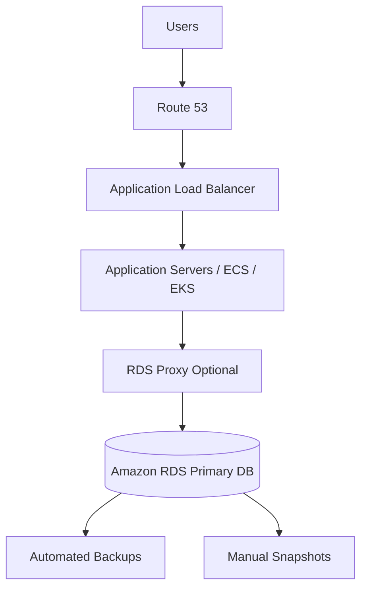
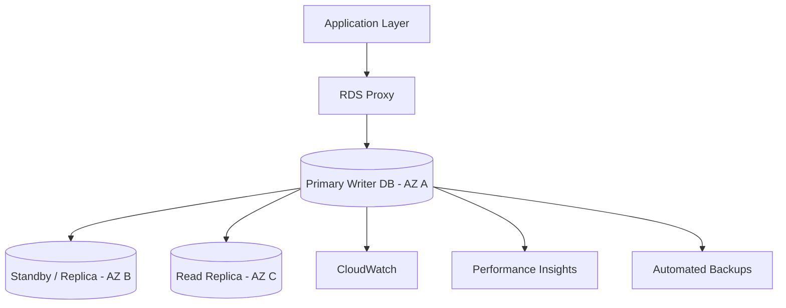
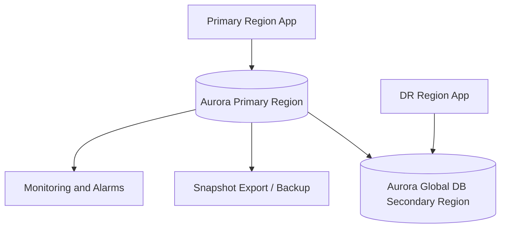
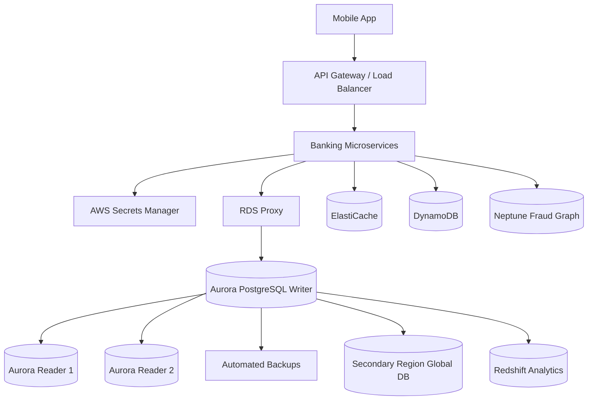

# AWS Databases and Amazon RDS Production Guide

> A beginner-friendly, GitHub-ready guide to databases, AWS database offerings, Amazon RDS, production best practices, enterprise use cases, and hands-on implementation using the AWS Console and AWS CLI.

---

## Table of Contents

1. [What is a Database?](#1-what-is-a-database)
2. [Types of Databases](#2-types-of-databases)
3. [AWS Database Offerings](#3-aws-database-offerings)
4. [What is Amazon RDS?](#4-what-is-amazon-rds)
5. [Amazon RDS Database Engines](#5-amazon-rds-database-engines)
6. [Important RDS Concepts](#6-important-rds-concepts)
7. [How RDS is Used in Production](#7-how-rds-is-used-in-production)
8. [RDS Production Architecture](#8-rds-production-architecture)
9. [RDS Best Practices](#9-rds-best-practices)
10. [Enterprise Use Case](#10-enterprise-use-case)
11. [Manual Implementation Guide Using AWS Console](#11-manual-implementation-guide-using-aws-console)
12. [Implementation Guide Using AWS CLI](#12-implementation-guide-using-aws-cli)
13. [Day-2 Operations](#13-day-2-operations)
14. [Common Interview and Real-World Questions](#14-common-interview-and-real-world-questions)
15. [References](#15-references)

---

## 1. What is a Database?

A **database** is a system used to store, organize, retrieve, update, and protect data.

Simple examples:

- An e-commerce website stores customers, products, carts, orders, and payments.
- A bank stores accounts, transactions, KYC details, loans, and audit logs.
- A hospital stores patients, doctors, appointments, prescriptions, and reports.
- A SaaS application stores users, subscriptions, settings, logs, and billing details.

Without a database, applications cannot reliably remember information.

### Database in simple language

Think of a database as a highly organized digital filing system.

A normal file may store data, but a database helps you:

- Search quickly
- Update safely
- Handle many users at the same time
- Avoid duplicate or inconsistent data
- Protect sensitive information
- Recover data after a failure
- Scale as the business grows

---

## 2. Types of Databases

Different applications need different database types. AWS follows a **purpose-built database** approach, which means choosing the database that best fits the workload instead of forcing every workload into one database.

### 2.1 Relational Databases

Relational databases store data in structured tables with rows and columns.

Example tables:

| Table | Stores |
|---|---|
| users | Customer profile information |
| orders | Order details |
| payments | Payment status |
| products | Product catalog |

Common engines:

- PostgreSQL
- MySQL
- MariaDB
- Oracle Database
- Microsoft SQL Server
- Amazon Aurora

Best for:

- Banking
- E-commerce
- ERP
- CRM
- Inventory
- HR systems
- Financial transactions
- Systems needing SQL and ACID transactions

### 2.2 Key-Value Databases

A key-value database stores data as a key and value pair.

Example:

```text
customer_101 -> { name: "Asha", plan: "premium", city: "Mumbai" }
```

Best for:

- User sessions
- Shopping carts
- Gaming profiles
- High-scale lookup systems
- Low-latency applications

AWS example: **Amazon DynamoDB**

### 2.3 Document Databases

Document databases store JSON-like documents.

Example:

```json
{
  "userId": "101",
  "name": "Asha",
  "addresses": [
    { "type": "home", "city": "Mumbai" },
    { "type": "office", "city": "Pune" }
  ]
}
```

Best for:

- Catalogs
- User profiles
- Content management
- Flexible schema applications

AWS example: **Amazon DocumentDB with MongoDB compatibility**

### 2.4 In-Memory Databases

In-memory databases keep data in memory for very fast access.

Best for:

- Caching
- Session storage
- Leaderboards
- Real-time counters
- Frequently accessed data

AWS examples:

- **Amazon ElastiCache**
- **Amazon MemoryDB**

### 2.5 Graph Databases

Graph databases store relationships between entities.

Example:

```text
Customer -> owns -> Account
Customer -> transferred_to -> Customer
Account -> used_at -> Merchant
```

Best for:

- Fraud detection
- Recommendation engines
- Social networks
- Knowledge graphs
- Identity relationships

AWS example: **Amazon Neptune**

### 2.6 Time Series Databases

Time series databases store data that changes over time.

Example:

```text
2026-06-25 10:00:00 | server_cpu | 72%
2026-06-25 10:01:00 | server_cpu | 75%
```

Best for:

- IoT sensor data
- DevOps metrics
- Application telemetry
- Industrial machine monitoring

AWS example: **Amazon Timestream**

### 2.7 Wide-Column Databases

Wide-column databases are used for high-scale distributed workloads.

Best for:

- Fleet management
- Industrial systems
- Route optimization
- Massive write-heavy workloads

AWS example: **Amazon Keyspaces for Apache Cassandra**

### 2.8 Data Warehouses

A data warehouse is used for analytics and reporting, not usually for live transactional application traffic.

Best for:

- Business intelligence
- Dashboards
- Historical reporting
- Large analytical queries

AWS example: **Amazon Redshift**

---

## 3. AWS Database Offerings

AWS provides many database services. The right choice depends on data model, latency, scale, query pattern, operational needs, and cost.

| AWS Service | Database Type | Best Use Case | Simple Explanation |
|---|---|---|---|
| Amazon RDS | Relational | Traditional applications, ERP, CRM, e-commerce | Managed MySQL, PostgreSQL, MariaDB, Oracle, SQL Server, Db2 |
| Amazon Aurora | Relational | High-performance enterprise relational workloads | AWS-built relational database compatible with MySQL and PostgreSQL |
| Amazon DynamoDB | Key-value/document NoSQL | High-scale apps, carts, gaming, serverless apps | Fast NoSQL database with single-digit millisecond performance at scale |
| Amazon ElastiCache | In-memory cache | Caching, sessions, leaderboards | Redis OSS or Memcached-compatible managed cache |
| Amazon MemoryDB | Durable in-memory database | Ultra-fast apps needing Redis compatibility and durability | Redis-compatible durable in-memory database |
| Amazon DocumentDB | Document | JSON documents, catalogs, user profiles | MongoDB-compatible managed document database |
| Amazon Neptune | Graph | Fraud detection, recommendations, social graphs | Managed graph database |
| Amazon Keyspaces | Wide-column | Cassandra workloads | Managed Apache Cassandra-compatible database |
| Amazon Timestream | Time series | IoT, monitoring, telemetry | Serverless time series database |
| Amazon Redshift | Data warehouse | BI, analytics, reporting | Cloud data warehouse |
| Amazon QLDB | Ledger | Immutable audit trail | Cryptographically verifiable journal database |
| AWS Glue Data Catalog | Metadata catalog | Data lake metadata | Catalog for analytics datasets |
| Amazon S3 | Object storage, not a database | Data lake, backups, files | Stores objects; often used with Athena/Glue for analytics |

### Choosing the right AWS database

Use this simple decision guide:

| Requirement | Recommended AWS Service |
|---|---|
| SQL, joins, transactions | Amazon RDS or Amazon Aurora |
| Very high-scale key-value access | Amazon DynamoDB |
| MongoDB-style JSON documents | Amazon DocumentDB |
| Caching and sub-millisecond reads | Amazon ElastiCache |
| Redis-compatible durable database | Amazon MemoryDB |
| Fraud or relationship analysis | Amazon Neptune |
| IoT and timestamped metrics | Amazon Timestream |
| Cassandra-compatible workloads | Amazon Keyspaces |
| Enterprise reporting and analytics | Amazon Redshift |
| Immutable ledger/audit history | Amazon QLDB |

---

## 4. What is Amazon RDS?

**Amazon RDS**, or **Amazon Relational Database Service**, is a managed relational database service from AWS.

In simple terms:

> RDS lets you run a production database without manually installing, patching, backing up, and maintaining database software on your own servers.

AWS manages common database administration tasks such as:

- Provisioning
- Storage management
- Automated backups
- Manual snapshots
- Software patching
- Monitoring integrations
- Replication options
- High availability options
- Failover options

Your team still manages:

- Database schema design
- Indexes
- Queries
- Application connection logic
- User permissions inside the database
- Data model
- Performance tuning
- Cost optimization
- Security configuration choices

### RDS is not serverless by default

Most RDS deployments use database instances that run continuously. Some Aurora options, such as Aurora Serverless, can scale capacity automatically based on demand.

---

## 5. Amazon RDS Database Engines

Amazon RDS supports several engines.

| Engine | Good For | Example Production Use |
|---|---|---|
| Amazon Aurora MySQL-Compatible | High-scale MySQL-compatible workloads | SaaS application backend |
| Amazon Aurora PostgreSQL-Compatible | Enterprise PostgreSQL workloads | Banking, fintech, order platforms |
| RDS for PostgreSQL | Open-source relational workloads | APIs, analytics-heavy applications |
| RDS for MySQL | Web applications | WordPress, e-commerce, custom apps |
| RDS for MariaDB | MySQL-like open-source workloads | Web and internal business apps |
| RDS for Oracle | Oracle enterprise workloads | ERP, legacy enterprise systems |
| RDS for SQL Server | Microsoft stack applications | .NET enterprise apps |
| RDS for Db2 | IBM Db2 workloads | Legacy enterprise modernization |

### RDS vs Aurora

| Area | Amazon RDS | Amazon Aurora |
|---|---|---|
| Engine model | Managed existing engines | AWS-built cloud-native relational database |
| Compatibility | MySQL, PostgreSQL, MariaDB, Oracle, SQL Server, Db2 | MySQL-compatible and PostgreSQL-compatible |
| Typical use | General relational workloads | High-performance enterprise workloads |
| Scaling | Instance scaling, read replicas | Advanced storage and replica architecture |
| Global database | Limited depending on engine | Strong Aurora Global Database support |
| Cost | Often simpler/lower for smaller workloads | Can be higher but powerful for enterprise scale |

---

## 6. Important RDS Concepts

### 6.1 DB Instance

A DB instance is the actual database server managed by RDS.

Example instance classes:

```text
db.t4g.micro
db.t4g.medium
db.m7g.large
db.r7g.large
```

Choose based on CPU, memory, network, and workload.

### 6.2 DB Engine

The DB engine is the database software.

Examples:

- PostgreSQL
- MySQL
- Oracle
- SQL Server
- MariaDB
- Db2
- Aurora MySQL
- Aurora PostgreSQL

### 6.3 Storage

RDS supports storage options such as General Purpose SSD and Provisioned IOPS depending on engine and workload.

Production databases should use enough storage and IOPS for peak traffic.

### 6.4 DB Subnet Group

A DB subnet group tells RDS which VPC subnets it can use.

Production recommendation:

- Use private subnets
- Include at least two Availability Zones
- Do not expose the database directly to the internet

### 6.5 Security Group

A security group acts like a virtual firewall.

Example:

- Application servers can connect to PostgreSQL port `5432`
- Public internet cannot connect to the database

### 6.6 Parameter Group

A parameter group controls database engine settings.

Examples:

- Logging settings
- Connection settings
- Query planner settings
- Timeout values

### 6.7 Option Group

Option groups are used for some engine-specific features, especially Oracle and SQL Server.

### 6.8 Multi-AZ

Multi-AZ means RDS keeps a highly available standby or clustered architecture across Availability Zones.

Purpose:

- High availability
- Automatic failover
- Better resilience

### 6.9 Read Replica

A read replica is a copy of the database used for read-heavy workloads.

Use read replicas for:

- Reports
- Search pages
- Product listing
- Dashboards
- Read-heavy APIs

### 6.10 Automated Backups

Automated backups allow point-in-time recovery within the configured retention period.

### 6.11 Manual Snapshots

Manual snapshots are backups you create and keep until you delete them.

Use them before:

- Major releases
- Schema migrations
- Database upgrades
- Risky data changes

### 6.12 RDS Proxy

RDS Proxy manages and pools database connections.

Useful for:

- Serverless applications
- Microservices
- Applications opening many short database connections
- Reducing connection storms during traffic spikes

### 6.13 Performance Insights

Performance Insights helps identify database bottlenecks and slow queries.

### 6.14 Enhanced Monitoring

Enhanced Monitoring provides operating system level metrics for DB instances.

---

## 7. How RDS is Used in Production

In production, RDS is usually placed behind application services, not directly exposed to users.

Typical request flow:

```text
Users
  -> Route 53 / DNS
  -> Load Balancer
  -> Application Service on EC2, ECS, EKS, or Lambda
  -> RDS Proxy optional
  -> Amazon RDS or Amazon Aurora
```

### Example production flow

1. Customer opens an e-commerce app.
2. Backend API reads product data from a read replica.
3. Customer places an order.
4. Backend API writes order and payment data to the primary database.
5. Database transaction commits successfully.
6. Inventory is updated.
7. Order confirmation is sent.
8. Reporting workloads run on read replicas or analytics systems, not on the primary database.

### Production goals

A production RDS setup should provide:

- Availability
- Security
- Backup and recovery
- Monitoring
- Performance
- Scalability
- Cost control
- Compliance readiness
- Disaster recovery

---

## 8. RDS Production Architecture

### 8.1 Basic Production Architecture



### 8.2 Highly Available Architecture



### 8.3 Enterprise Multi-Region Architecture



---

## 9. RDS Best Practices

### 9.1 Security Best Practices

#### Keep RDS private

Do not make production RDS publicly accessible.

Recommended:

- RDS in private subnets
- Application in private or public/private architecture
- Only application security group can access RDS
- No direct database access from the internet

#### Use least privilege

Give users and applications only the permissions they need.

Examples:

- App user can read/write application tables
- Reporting user can only read reporting views
- Admin user is restricted to DBAs

#### Use encryption

Enable:

- Encryption at rest using AWS KMS
- Encryption in transit using TLS/SSL

#### Use Secrets Manager

Avoid storing database passwords in code, GitHub, AMIs, Docker images, or plain environment files.

Use:

- AWS Secrets Manager
- IAM roles for applications
- Secret rotation where appropriate

#### Enable auditing and logging

Depending on engine, enable logs such as:

- Error logs
- Slow query logs
- General logs where appropriate
- PostgreSQL logs
- Audit logs if required

---

### 9.2 Availability Best Practices

#### Use Multi-AZ for production

Multi-AZ protects against infrastructure failure in one Availability Zone.

Use it for:

- Banking
- Payments
- Healthcare
- ERP
- Order management
- SaaS production workloads

#### Use read replicas for reads

Use read replicas when read traffic is high.

Examples:

- Product catalog browsing
- Search pages
- Customer history pages
- Dashboards
- Reports

#### Test failover

Do not assume failover works. Test it during planned windows.

---

### 9.3 Backup and Recovery Best Practices

#### Enable automated backups

Set backup retention based on business requirements.

Example:

| Environment | Retention |
|---|---|
| Dev | 1-3 days |
| Test | 3-7 days |
| Production | 7-35 days depending on compliance |

#### Take manual snapshots before risky changes

Create a snapshot before:

- Engine upgrades
- Major deployments
- Schema migrations
- Bulk data updates
- Data cleanup scripts

#### Define RPO and RTO

| Term | Meaning | Example |
|---|---|---|
| RPO | Maximum acceptable data loss | 5 minutes |
| RTO | Maximum acceptable recovery time | 30 minutes |

---

### 9.4 Performance Best Practices

#### Choose the right instance class

CPU-heavy workload:

- Use compute-optimized or general-purpose classes

Memory-heavy workload:

- Use memory-optimized classes

Burstable small workload:

- Use burstable classes for dev/test or smaller apps

#### Add indexes carefully

Indexes improve reads but can slow writes.

Create indexes for:

- Frequently filtered columns
- Join keys
- Sort columns
- Foreign keys

Avoid:

- Too many indexes
- Unused indexes
- Indexing every column

#### Monitor slow queries

Use:

- Performance Insights
- CloudWatch metrics
- Engine-specific logs
- Query explain plans

#### Use connection pooling

Use RDS Proxy or application connection pools.

This prevents too many direct connections to the database.

---

### 9.5 Cost Best Practices

#### Right-size instances

Do not overprovision without evidence.

Review:

- CPU utilization
- Memory pressure
- Connections
- IOPS
- Storage growth

#### Stop non-production databases when not needed

For dev/test, schedule stop/start if supported and acceptable.

#### Use Reserved Instances or Savings Plans where applicable

For stable production workloads, reserved capacity may reduce cost.

#### Avoid unnecessary read replicas

Read replicas cost money. Add them when metrics show read pressure or business need.

---

### 9.6 Operational Best Practices

#### Use Infrastructure as Code

For enterprise workloads, prefer:

- Terraform
- AWS CloudFormation
- AWS CDK

Manual setup is useful for learning, but production should be repeatable.

#### Use separate environments

Recommended:

```text
Dev -> Test -> Stage -> Production
```

Never test risky changes directly on production.

#### Use maintenance windows

Schedule patching and upgrades during low-traffic periods.

#### Document runbooks

Create runbooks for:

- Failover
- Restore from backup
- Snapshot creation
- Slow query investigation
- Storage full alert
- Connection spike
- Credential rotation

---

## 10. Enterprise Use Case

### Use Case: Banking Mobile Application

A bank runs a mobile banking application used by millions of customers.

Customers can:

- Check account balance
- View transactions
- Transfer money
- Pay bills
- Download statements
- Update profile information

### Requirements

The bank needs:

- High availability
- Strong consistency for money movement
- Secure access
- Encrypted customer data
- Auditability
- Backup and restore
- Disaster recovery
- Performance during salary days and bill payment peaks
- Compliance controls

### Recommended AWS Database Architecture

| Workload | AWS Database Choice | Reason |
|---|---|---|
| Core transactions | Amazon Aurora PostgreSQL | Relational transactions, high availability, SQL support |
| Session cache | Amazon ElastiCache | Fast session and token lookup |
| Fraud graph | Amazon Neptune | Relationship-based fraud detection |
| Audit archive | Amazon S3 plus analytics | Long-term low-cost storage |
| Reporting warehouse | Amazon Redshift | Business intelligence and historical analysis |
| Notification status lookup | DynamoDB | High-scale key-value access |

### Core RDS/Aurora Architecture



### How this works in production

#### Balance check

1. Customer opens the mobile app.
2. API authenticates the user.
3. Application reads balance from Aurora reader or optimized read path.
4. Response is returned to the user.

#### Money transfer

1. Customer submits transfer.
2. API validates identity, limits, and fraud rules.
3. Application starts a database transaction on the Aurora writer.
4. Debit and credit records are written atomically.
5. Transaction commits.
6. Audit event is stored.
7. Notification is sent.

#### Reporting

1. Transaction data is replicated or exported to analytics systems.
2. Redshift handles heavy reporting queries.
3. Core transaction database is not overloaded by analytics.

### Why not use only one database?

An enterprise system rarely uses only one database type.

Use the right database for the right job:

- Aurora for transactions
- ElastiCache for fast cache
- DynamoDB for massive key-value lookups
- Neptune for relationships
- Redshift for analytics
- S3 for low-cost long-term storage

This is called a purpose-built database architecture.

---

## 11. Manual Implementation Guide Using AWS Console

This guide creates a production-style Amazon RDS for PostgreSQL database.

> Note: Exact UI labels may change over time, but the production concepts remain the same.

### 11.1 Prerequisites

You need:

- AWS account
- IAM user or role with RDS, EC2/VPC, KMS, Secrets Manager, and CloudWatch permissions
- VPC with at least two private subnets in different Availability Zones
- Application security group
- KMS key for encryption, or AWS managed key

### 11.2 Create Security Group for RDS

1. Open **VPC Console**.
2. Go to **Security Groups**.
3. Create a security group named `prod-rds-postgres-sg`.
4. Select your production VPC.
5. Add inbound rule:

| Type | Port | Source |
|---|---:|---|
| PostgreSQL | 5432 | Application security group |

6. Do not allow `0.0.0.0/0` for production database access.

### 11.3 Create DB Subnet Group

1. Open **RDS Console**.
2. Go to **Subnet groups**.
3. Create subnet group named `prod-rds-subnet-group`.
4. Select the production VPC.
5. Add private subnets from at least two Availability Zones.

### 11.4 Create RDS PostgreSQL Instance

1. Open **RDS Console**.
2. Choose **Create database**.
3. Choose **Standard create**.
4. Engine: **PostgreSQL**.
5. Template: **Production**.
6. DB instance identifier: `prod-orders-postgres`.
7. Master username: `dbadmin`.
8. Use password generated/stored in Secrets Manager if available.
9. Instance class: choose based on workload, for example `db.m7g.large` for production baseline.
10. Storage: General Purpose SSD or Provisioned IOPS based on performance need.
11. Enable storage autoscaling.
12. Enable Multi-AZ.
13. Choose VPC and DB subnet group.
14. Public access: **No**.
15. Choose RDS security group.
16. Enable encryption.
17. Set backup retention, for example 7-35 days.
18. Enable Performance Insights.
19. Enable Enhanced Monitoring if needed.
20. Set maintenance window.
21. Create database.

### 11.5 Create Read Replica

1. Open the RDS instance.
2. Choose **Actions**.
3. Choose **Create read replica**.
4. Select instance size.
5. Place it in another Availability Zone if appropriate.
6. Enable monitoring.
7. Create replica.

### 11.6 Configure CloudWatch Alarms

Create alarms for:

- CPUUtilization
- FreeStorageSpace
- DatabaseConnections
- ReadLatency
- WriteLatency
- ReplicaLag
- FreeableMemory

Example alarm thresholds:

| Metric | Example Threshold |
|---|---:|
| CPUUtilization | Greater than 80% for 5 minutes |
| FreeStorageSpace | Less than 20% |
| DatabaseConnections | Greater than expected max |
| ReplicaLag | Greater than 60 seconds |
| FreeableMemory | Too low for sustained period |

### 11.7 Store Credentials in Secrets Manager

1. Open **Secrets Manager**.
2. Store database credentials.
3. Attach IAM permission to application role.
4. Application retrieves secret at runtime.

### 11.8 Connect Application to RDS

Use endpoint format:

```text
prod-orders-postgres.xxxxx.region.rds.amazonaws.com:5432
```

Application should use:

- TLS connection
- Secret from Secrets Manager
- Connection pooling
- Retry logic
- Timeout settings

### 11.9 Test Failover

1. Schedule a maintenance window.
2. Notify stakeholders.
3. Use RDS reboot with failover option.
4. Verify application reconnects.
5. Check logs and alarms.
6. Document recovery time.

---

## 12. Implementation Guide Using AWS CLI

This section shows a CLI-based setup for Amazon RDS for PostgreSQL.

> Replace placeholder values such as VPC ID, subnet IDs, security group IDs, passwords, and region before running.

### 12.1 Set Variables

```bash
export AWS_REGION="ap-south-1"
export VPC_ID="vpc-xxxxxxxx"
export APP_SG_ID="sg-application123"
export DB_SUBNET_1="subnet-private-a"
export DB_SUBNET_2="subnet-private-b"
export DB_SUBNET_GROUP="prod-rds-subnet-group"
export DB_SG_NAME="prod-rds-postgres-sg"
export DB_INSTANCE_ID="prod-orders-postgres"
export DB_NAME="ordersdb"
export DB_USERNAME="dbadmin"
export DB_PASSWORD="ChangeMeUseSecretsManager123!"
```

### 12.2 Create RDS Security Group

```bash
aws ec2 create-security-group \
  --group-name "$DB_SG_NAME" \
  --description "Security group for production RDS PostgreSQL" \
  --vpc-id "$VPC_ID" \
  --region "$AWS_REGION"
```

Capture the security group ID:

```bash
export DB_SG_ID=$(aws ec2 describe-security-groups \
  --filters "Name=group-name,Values=$DB_SG_NAME" "Name=vpc-id,Values=$VPC_ID" \
  --query "SecurityGroups[0].GroupId" \
  --output text \
  --region "$AWS_REGION")
```

Allow PostgreSQL traffic only from the application security group:

```bash
aws ec2 authorize-security-group-ingress \
  --group-id "$DB_SG_ID" \
  --protocol tcp \
  --port 5432 \
  --source-group "$APP_SG_ID" \
  --region "$AWS_REGION"
```

### 12.3 Create DB Subnet Group

```bash
aws rds create-db-subnet-group \
  --db-subnet-group-name "$DB_SUBNET_GROUP" \
  --db-subnet-group-description "Private subnet group for production RDS" \
  --subnet-ids "$DB_SUBNET_1" "$DB_SUBNET_2" \
  --region "$AWS_REGION"
```

### 12.4 Create RDS PostgreSQL Instance

```bash
aws rds create-db-instance \
  --db-instance-identifier "$DB_INSTANCE_ID" \
  --db-name "$DB_NAME" \
  --engine postgres \
  --engine-version "16.3" \
  --db-instance-class db.m7g.large \
  --allocated-storage 100 \
  --storage-type gp3 \
  --storage-encrypted \
  --master-username "$DB_USERNAME" \
  --master-user-password "$DB_PASSWORD" \
  --vpc-security-group-ids "$DB_SG_ID" \
  --db-subnet-group-name "$DB_SUBNET_GROUP" \
  --backup-retention-period 7 \
  --preferred-backup-window "18:00-19:00" \
  --preferred-maintenance-window "sun:19:00-sun:20:00" \
  --multi-az \
  --publicly-accessible false \
  --deletion-protection \
  --enable-performance-insights \
  --auto-minor-version-upgrade \
  --region "$AWS_REGION"
```

Wait until the instance is available:

```bash
aws rds wait db-instance-available \
  --db-instance-identifier "$DB_INSTANCE_ID" \
  --region "$AWS_REGION"
```

Get the database endpoint:

```bash
aws rds describe-db-instances \
  --db-instance-identifier "$DB_INSTANCE_ID" \
  --query "DBInstances[0].Endpoint.Address" \
  --output text \
  --region "$AWS_REGION"
```

### 12.5 Create a Manual Snapshot

```bash
aws rds create-db-snapshot \
  --db-instance-identifier "$DB_INSTANCE_ID" \
  --db-snapshot-identifier "${DB_INSTANCE_ID}-pre-release-snapshot" \
  --region "$AWS_REGION"
```

### 12.6 Create a Read Replica

```bash
aws rds create-db-instance-read-replica \
  --db-instance-identifier "${DB_INSTANCE_ID}-reader-1" \
  --source-db-instance-identifier "$DB_INSTANCE_ID" \
  --db-instance-class db.m7g.large \
  --publicly-accessible false \
  --region "$AWS_REGION"
```

### 12.7 Create CloudWatch Alarm for CPU

```bash
aws cloudwatch put-metric-alarm \
  --alarm-name "rds-prod-high-cpu" \
  --alarm-description "RDS CPU greater than 80 percent" \
  --metric-name CPUUtilization \
  --namespace AWS/RDS \
  --statistic Average \
  --period 300 \
  --threshold 80 \
  --comparison-operator GreaterThanThreshold \
  --dimensions Name=DBInstanceIdentifier,Value="$DB_INSTANCE_ID" \
  --evaluation-periods 2 \
  --region "$AWS_REGION"
```

### 12.8 Reboot with Failover Test

Use carefully in a planned test window:

```bash
aws rds reboot-db-instance \
  --db-instance-identifier "$DB_INSTANCE_ID" \
  --force-failover \
  --region "$AWS_REGION"
```

### 12.9 Modify Backup Retention

```bash
aws rds modify-db-instance \
  --db-instance-identifier "$DB_INSTANCE_ID" \
  --backup-retention-period 14 \
  --apply-immediately \
  --region "$AWS_REGION"
```

### 12.10 Restore from Snapshot

```bash
aws rds restore-db-instance-from-db-snapshot \
  --db-instance-identifier "prod-orders-postgres-restore-test" \
  --db-snapshot-identifier "${DB_INSTANCE_ID}-pre-release-snapshot" \
  --db-instance-class db.m7g.large \
  --db-subnet-group-name "$DB_SUBNET_GROUP" \
  --vpc-security-group-ids "$DB_SG_ID" \
  --publicly-accessible false \
  --region "$AWS_REGION"
```

---

## 13. Day-2 Operations

Day-2 operations are the activities required after the database is live.

### 13.1 Monitoring Checklist

Monitor these metrics daily or through alarms:

| Metric | Why It Matters |
|---|---|
| CPUUtilization | High CPU may indicate heavy queries or undersized instance |
| FreeableMemory | Low memory may cause performance issues |
| DatabaseConnections | Too many connections can exhaust DB capacity |
| FreeStorageSpace | Low storage can cause outage risk |
| ReadLatency | Indicates read performance |
| WriteLatency | Indicates write performance |
| ReplicaLag | Shows read replica delay |
| DiskQueueDepth | Indicates storage pressure |
| Deadlocks | Shows transaction contention |

### 13.2 Backup Checklist

- Automated backups enabled
- Backup retention meets business policy
- Manual snapshots before major changes
- Restore test performed regularly
- Snapshot access restricted
- Cross-region backup strategy if required

### 13.3 Security Checklist

- RDS is private
- Public access disabled
- Security group allows only application access
- Encryption at rest enabled
- TLS used in transit
- Credentials stored in Secrets Manager
- IAM permissions follow least privilege
- Database users follow least privilege
- Logs enabled where required

### 13.4 Performance Checklist

- Slow queries reviewed
- Indexes reviewed
- Read replicas used appropriately
- Connection pooling enabled
- Instance class right-sized
- Storage IOPS sufficient
- Reports moved away from primary database

### 13.5 Change Management Checklist

Before production changes:

1. Create snapshot.
2. Review rollback plan.
3. Test in staging.
4. Schedule maintenance window.
5. Notify stakeholders.
6. Apply change.
7. Validate application.
8. Monitor metrics.
9. Document result.

---

## 14. Common Interview and Real-World Questions

### What is RDS?

Amazon RDS is a managed relational database service that helps you run relational databases in AWS without manually managing database servers.

### Is RDS fully managed?

RDS is managed at the infrastructure and database software operation level. You still manage schema, queries, indexes, users, data access, and application behavior.

### What is Multi-AZ?

Multi-AZ is a high availability setup that places database infrastructure across multiple Availability Zones and supports failover.

### What is a read replica?

A read replica is a copy of the primary database used to scale read traffic.

### What is the difference between backup and read replica?

A backup is used for recovery. A read replica is used for serving read traffic and sometimes disaster recovery depending on design.

### Should production RDS be public?

Usually no. Production RDS should normally be private and accessible only from application resources or controlled administrative paths.

### What is RDS Proxy?

RDS Proxy pools and manages database connections, helping applications scale and recover from connection storms.

### When should I use Aurora instead of standard RDS?

Use Aurora when you need higher performance, stronger cloud-native availability features, advanced replica architecture, or global database capabilities while staying MySQL/PostgreSQL compatible.

### When should I not use RDS?

Do not use RDS when the workload is better suited for NoSQL, graph, time series, in-memory cache, or analytics warehouse patterns.

---

## 15. References

Official AWS references used for this guide:

- Amazon RDS and Aurora Documentation: <https://docs.aws.amazon.com/rds/>
- AWS Database Services Overview: <https://docs.aws.amazon.com/whitepapers/latest/aws-overview/database.html>
- Choosing an AWS Database Service: <https://docs.aws.amazon.com/databases-on-aws-how-to-choose/>
- Amazon RDS Best Practices: <https://docs.aws.amazon.com/AmazonRDS/latest/UserGuide/CHAP_BestPractices.html>
- Amazon RDS Security Best Practices: <https://docs.aws.amazon.com/AmazonRDS/latest/UserGuide/CHAP_BestPractices.Security.html>
- Amazon RDS Backups: <https://docs.aws.amazon.com/AmazonRDS/latest/UserGuide/USER_WorkingWithAutomatedBackups.html>
- Amazon RDS Read Replicas: <https://docs.aws.amazon.com/AmazonRDS/latest/UserGuide/USER_ReadRepl.html>
- Amazon RDS Multi-AZ DB Clusters: <https://docs.aws.amazon.com/AmazonRDS/latest/UserGuide/multi-az-db-clusters-concepts.html>
- Amazon RDS in a VPC: <https://docs.aws.amazon.com/AmazonRDS/latest/UserGuide/USER_VPC.WorkingWithRDSInstanceinaVPC.html>
- AWS CLI RDS Reference: <https://docs.aws.amazon.com/cli/latest/reference/rds/>
- AWS CLI create-db-instance: <https://docs.aws.amazon.com/cli/latest/reference/rds/create-db-instance.html>
- AWS CLI create-db-subnet-group: <https://docs.aws.amazon.com/cli/latest/reference/rds/create-db-subnet-group.html>
- Amazon RDS CLI Examples: <https://docs.aws.amazon.com/cli/latest/userguide/cli_rds_code_examples.html>

---

## Suggested Repository Structure

```text
aws-rds-documentation/
├── README.md
├── docs/
│   ├── architecture.md
│   ├── implementation-cli.md
│   ├── implementation-console.md
│   └── operations-runbook.md
├── diagrams/
│   └── rds-production-architecture.mmd
└── scripts/
    ├── create-rds-postgres.sh
    ├── create-read-replica.sh
    └── create-rds-alarms.sh
```

---

## Final Summary

Amazon RDS is one of the most commonly used AWS services for production relational databases. It is best suited for applications that need SQL, structured data, transactions, backups, high availability, and managed operations.

For enterprise environments, RDS or Aurora should be deployed with:

- Private subnets
- Strict security groups
- Encryption
- Multi-AZ
- Backups
- Monitoring
- Read replicas where needed
- Secrets Manager
- Connection pooling
- Tested restore and failover runbooks

A good production database design is not just about creating the database. It is about securing it, monitoring it, backing it up, testing recovery, and choosing the right AWS database service for each workload.
