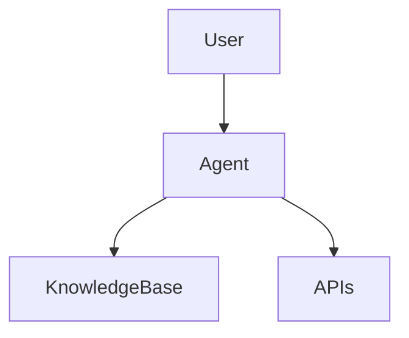

# 🤖 AWS Bedrock AgentCore Enterprise Guide

## Architecture

## Use Cases
- AI copilots
- Banking assistant bots

## Production Pattern
- API Gateway + Lambda + Bedrock

## Security
- IAM + audit logs

## Cost
- Token usage optimization
