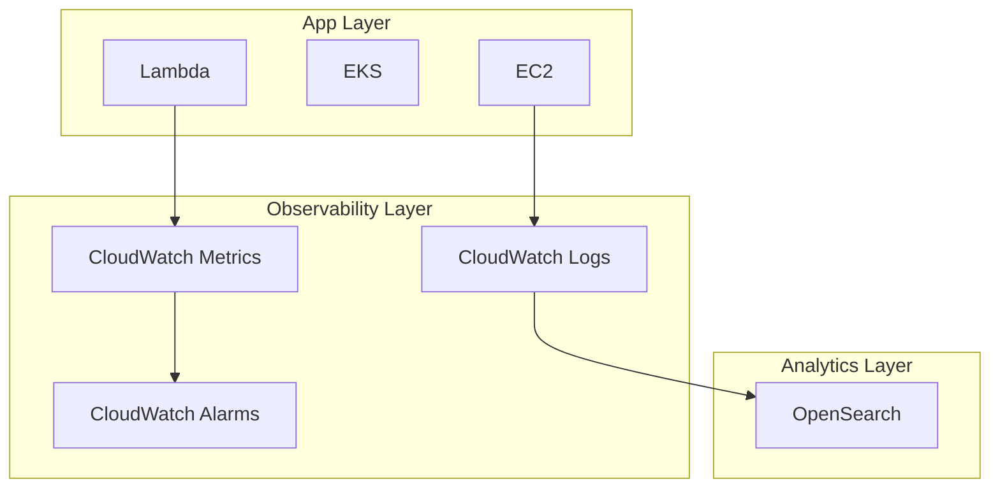

# 📊 AWS CloudWatch Enterprise Architecture Guide

## Overview
CloudWatch is the backbone of AWS observability, enabling enterprise-grade monitoring, alerting, and automated remediation.

---

## 🏗️ Deep Architecture (Layered)


---

## 🏢 Enterprise Use Cases
### FinTech
- Fraud detection via anomaly alarms

### SaaS
- Tenant-level monitoring dashboards

### Banking
- Compliance log retention (7+ years)

---

## 🧱 Multi-Account Pattern
- Central logging account
- Cross-account log subscription

---

## 🔐 Security & Compliance
- Encrypt logs (KMS)
- Audit trails (CloudTrail + CloudWatch)
- SOC2 log retention policies

---

## 💰 Cost Optimization
- Use log retention policies
- Filter unnecessary logs

---

## 🔍 Observability Pipeline
CloudWatch → Kinesis → OpenSearch → Dashboards

---

## ⚙️ CLI Example
```bash
aws logs create-log-group --log-group-name app-logs
```
