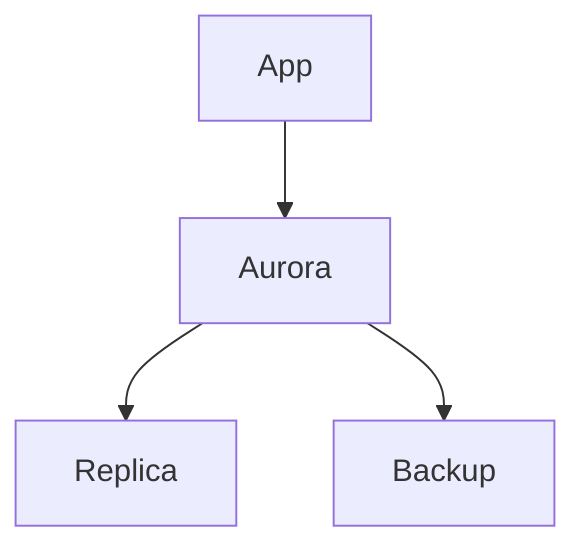

# 🗄️ AWS Databases Enterprise Architecture Guide

## Architecture Diagram


## Advanced Patterns
- Sharding
- Multi-AZ + Multi-Region DR

## Use Cases
### FinTech
- High TPS transactional systems

### SaaS
- Tenant-partitioned DB

### Banking
- Strong consistency DBs

## Security
- Encryption + IAM auth

## Cost Optimization
- Use Aurora Serverless

## CLI
```bash
aws rds describe-db-instances
```
