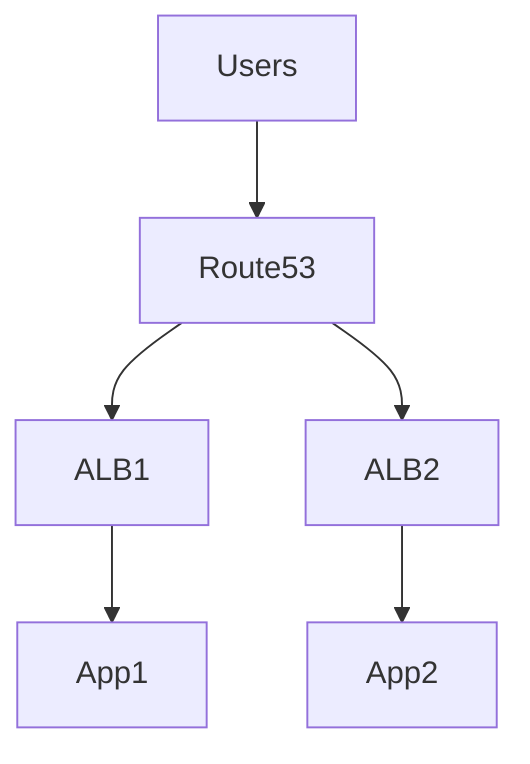

# 🌍 AWS Route53 Enterprise Architecture Guide

## 🏗️ Architecture Diagram


---

## 🏢 Use Cases
### FinTech
- Low-latency trading systems

### SaaS
- Geo-based routing

### Banking
- Disaster recovery routing

---

## 🧱 Multi-Account Pattern
- Central DNS management account

---

## 🔐 Security
- DNSSEC
- Private hosted zones

---

## 💰 Cost Optimization
- Use alias records instead of CNAME

---

## ⚙️ CLI
```bash
aws route53 list-hosted-zones
```
