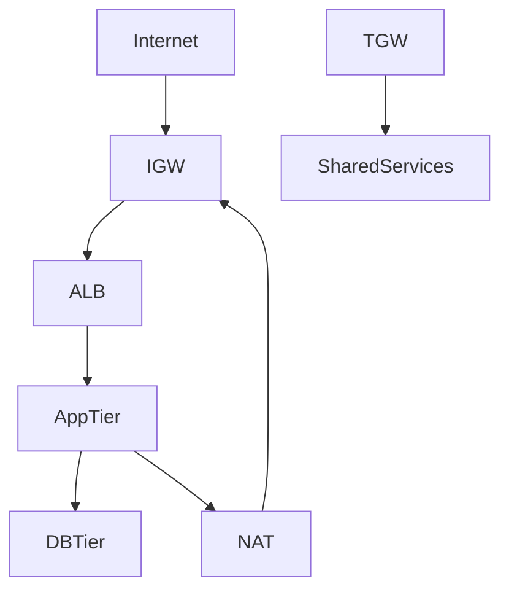

# 🌐 AWS VPC Enterprise Architecture (Enterprise Guide)

## 📘 Overview
This document provides an enterprise-level deep dive into AWS VPC design, architecture patterns, production use cases, and CLI implementation guidance.

---

## 🧠 What is a VPC?
A Virtual Private Cloud (VPC) is a logically isolated network in AWS where resources can be launched securely using defined CIDR ranges.

---

## 🧩 Core Components

### Subnets
- Public Subnet: Internet-facing workloads
- Private Subnet: Application/backend layer
- Isolated Subnet: Databases, no outbound internet

### Internet Gateway (IGW)
Enables inbound/outbound internet access.

### NAT Gateway
Provides outbound connectivity for private subnets.

### Route 53
AWS DNS service for routing (public/private zones).

### Security Controls
- Security Groups: Stateful firewall (instance level)
- NACL: Stateless firewall (subnet level)

### Connectivity
- VPC Peering: Point-to-point VPC connection
- Transit Gateway: Scalable hub-and-spoke networking

---

## 🏗️ Advanced Architecture Patterns

### 1. Multi-Tier Architecture
- Public: ALB
- Private: App tier
- Isolated: DB tier

### 2. Hub and Spoke
- Centralized networking via Transit Gateway
- Shared services VPC (logging, security)

### 3. Multi-Region Active-Active
- Route 53 latency routing
- Replicated services across regions

### 4. Zero Trust Architecture
- No implicit trust across tiers
- Strict SG rules + PrivateLink

### 5. Hybrid Cloud
- On-premises + AWS via VPN / Direct Connect

---

## 🏭 Expanded Production Use Cases

### ✅ SaaS Multi-Tenant Platform
- Each tenant isolated via VPC or subnet segmentation
- PrivateLink used for secure service exposure

### ✅ Financial Systems (Highly Regulated)
- Isolated subnets for DB and encryption services
- NACL deny rules for added security

### ✅ Data Lake Architecture
- Private access to S3 via VPC Endpoints
- No internet exposure

### ✅ CI/CD Infrastructure
- Build servers in private subnet
- Artifact storage via VPC endpoint (S3)

### ✅ Disaster Recovery (DR)
- Cross-region VPC replication
- Backup routing via Route 53 failover

---

## 🏗️ Architecture Diagram (Mermaid)


---

## ⚙️ AWS CLI Implementation

### Create VPC
```bash
aws ec2 create-vpc --cidr-block 10.0.0.0/16
```

### Create Subnet
```bash
aws ec2 create-subnet --vpc-id <vpc-id> --cidr-block 10.0.1.0/24
```

### Attach IGW
```bash
aws ec2 create-internet-gateway
aws ec2 attach-internet-gateway --vpc-id <vpc-id> --internet-gateway-id <igw-id>
```

### Create NAT Gateway
```bash
aws ec2 allocate-address
aws ec2 create-nat-gateway --subnet-id <subnet-id> --allocation-id <eip-id>
```

### Create Route
```bash
aws ec2 create-route --route-table-id <rt-id> --destination-cidr-block 0.0.0.0/0 --gateway-id <igw-id>
```

### Create Security Group
```bash
aws ec2 create-security-group --group-name app-sg --description "App SG" --vpc-id <vpc-id>
```

---

## 🔐 Best Practices
- Use private subnets for all backend resources
- Enable VPC Flow Logs
- Deploy multi-AZ architecture
- Use Transit Gateway at scale
- Avoid direct internet exposure for DB

---

## 📊 Observability
- CloudWatch
- VPC Flow Logs
- AWS Config
- GuardDuty

---

## ✅ Conclusion
A well-architected VPC ensures scalability, security, and high availability for enterprise cloud workloads.
